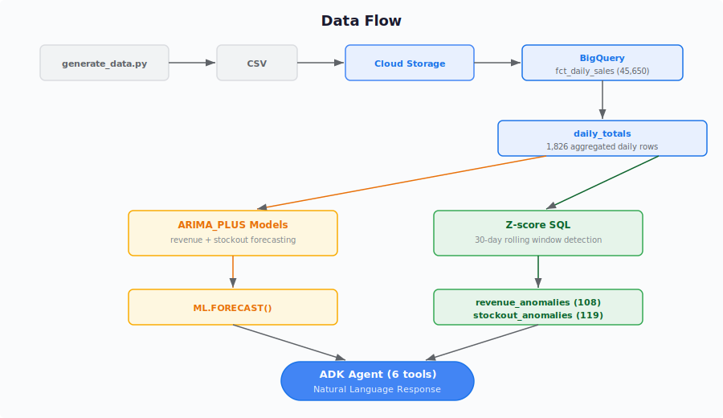

# Architecture: ADK Anomaly Detection Agent

## System Overview

This system combines two complementary approaches to anomaly detection in retail time-series data:

1. **Statistical Detection (Z-score)**: Identifies historical anomalies by comparing daily values against a 30-day rolling average. Days where the value deviates by more than 2 standard deviations are flagged.

2. **ML Forecasting (ARIMA_PLUS)**: BigQuery ML models trained on 5 years of daily data predict future revenue and stockout levels. The models automatically decompose trend, weekly seasonality, yearly seasonality, and US holiday effects.

An ADK agent powered by Gemini 2.5 Flash provides a natural language interface to both systems, explaining anomalies in context and generating forecasts on demand.

## Data Flow

## Architectural Decision Records

### ADR-1: ADK as Agent Framework

**Context**: Multiple agent frameworks are available including LangChain, LangGraph, CrewAI, AutoGen, and ADK.

**Decision**: Google ADK.

**Rationale**: Native BigQuery integration via google-cloud-bigquery, Gemini-optimized tool calling, consistent with existing portfolio (Project 3), and minimal boilerplate for single-agent systems. ADK's tool registration pattern (plain Python functions with type hints) maps cleanly to BigQuery query wrappers.

### ADR-2: AI Studio over Vertex AI

**Context**: Gemini can be accessed via Vertex AI or AI Studio.

**Decision**: AI Studio free tier.

**Rationale**: The GCP sandbox blocks `aiplatform.googleapis.com`. AI Studio provides the same Gemini 2.5 Flash model via API key authentication at zero cost. The tradeoff is no Vertex AI logging or model management, which is acceptable for a portfolio project.

### ADR-3: Single Specialist Agent (not Multi-Agent)

**Context**: Project 3 used a multi-agent orchestrator with 3 sub-agents. The same pattern could be applied here.

**Decision**: Single agent with 6 tools.

**Rationale**: All tools serve one domain (anomaly detection and forecasting). A multi-agent split would add routing complexity without benefit. The agent's instruction prompt is focused enough that Gemini consistently selects the correct tool. This demonstrates that not every problem needs multi-agent architecture. Right-sizing matters.

### ADR-4: Z-score + ARIMA_PLUS Hybrid Detection

**Context**: ARIMA_PLUS has a built-in ML.DETECT_ANOMALIES function. However, it returned NULL probabilities for all historical data because the has_spikes_and_dips decomposition feature absorbed the anomalies into the model rather than flagging them as outliers.

**Decision**: Z-score statistical detection for historical anomalies, ARIMA_PLUS for future forecasting.

**Rationale**: Z-score against a 30-day rolling average is interpretable (easy to explain in natural language), reliable (no model training quirks), and fast (pure SQL window functions). ARIMA_PLUS excels at forecasting with confidence intervals. The hybrid gives the best of both: retrospective detection and prospective prediction.

**Tradeoff**: Z-score does not account for seasonality. A November revenue spike might be flagged even though holiday season is expected. Acceptable for this dataset because the seasonal patterns are moderate. A production system would use seasonally-adjusted Z-scores.

### ADR-5: Fixed SQL over Text-to-SQL

**Context**: The agent could generate SQL dynamically based on user questions.

**Decision**: All 6 tools use pre-written, parameterized SQL.

**Rationale**: Fixed SQL guarantees read-only access (no DROP TABLE possible), predictable cost (no runaway queries), consistent results, and easier testing. Parameters are limited to safe types (int for days/horizon, string for date). This is a security-first choice documented across the portfolio.

### ADR-6: Dict Return Contract with Status Field

**Context**: Tools need to return data to the LLM in a format it can reason about.

**Decision**: Every tool returns `{"status": "success", ...data}` with JSON-serializable values.

**Rationale**: Consistent contract across all tools. The status field enables error handling patterns. All BigQuery types (date, Decimal) are converted to JSON-safe types (ISO strings, floats) in the _run_query helper. Established in Project 3, continued here for portfolio consistency.

### ADR-7: Synthetic Data with Injected Anomalies

**Context**: The system needs realistic time-series data for ML training and anomaly detection demonstration.

**Decision**: Generate 5 years of synthetic daily sales data with 10 deliberately injected anomaly windows.

**Rationale**: Injected anomalies serve as ground truth for validating detection accuracy. The data generator includes seasonal patterns (holiday, summer), weekly patterns (weekend spikes), growth trend (3% annual), and regional/category multipliers for realistic variance. The anomaly_reference table provides a lookup for known events, enabling the agent to cross-reference detected anomalies with business context.

## BigQuery ML Model Details

### Revenue Forecast Model

| Property | Value |
|----------|-------|
| Type | ARIMA_PLUS |
| Best Candidate | ARIMA(1,1,1) without drift |
| Seasonality | Weekly + Yearly (auto-detected) |
| Holiday Region | US |
| Features | Holiday effects, step changes |
| AIC | 42,027.76 |

### Stockout Forecast Model

| Property | Value |
|----------|-------|
| Type | ARIMA_PLUS |
| Best Candidate | ARIMA(0,1,1) without drift |
| Seasonality | None detected (stockouts are event-driven) |
| Holiday Region | US |
| Features | Holiday effects, spikes and dips, step changes |
| AIC | 11,031.02 |

## Anomaly Detection Statistics

| Metric | Revenue | Stockout |
|--------|---------|----------|
| Total anomalies detected | 108 | 119 |
| Matched injected events | 31 | 36 |
| Detection method | Z-score +/- 2.0 | Z-score > 2.0 |
| Rolling window | 30 days | 30 days |
| Max Z-score | 30.03 | 92.36 |
| Avg Z-score (surges) | 2.96 | 5.17 |
| Avg Z-score (drops) | -2.69 | N/A |
